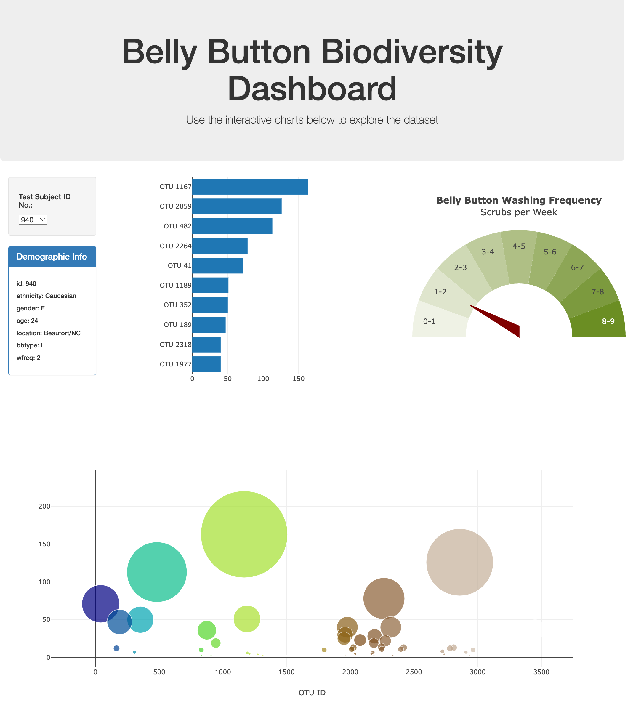

# belly-button-challenge

In this assignment, students are required to build an interactive dashboard that diplays data from the [belly button diversity project](http://robdunnlab.com/projects/belly-button-biodiversity/).

In the working dashboard deployed at [https://andrew-fellowes.github.io/belly-button-challenge/](https://andrew-fellowes.github.io/belly-button-challenge/), plotly plots and demographic information are refreshed aoutomatically when a new subject ID is selected from the dropdown.

The bonus challenge was to create a gauge type display with a needle pointer. This was challenging. My version is similar to the example provided.

# Tools and Libraries
Plotly.com

Javascript

HTML

D3.js

JSON

GitHub Pages

https://stackoverflow.com/questions/37454438/how-to-rotate-the-dial-in-a-gauge-chart-using-python-plotly?rq=3

